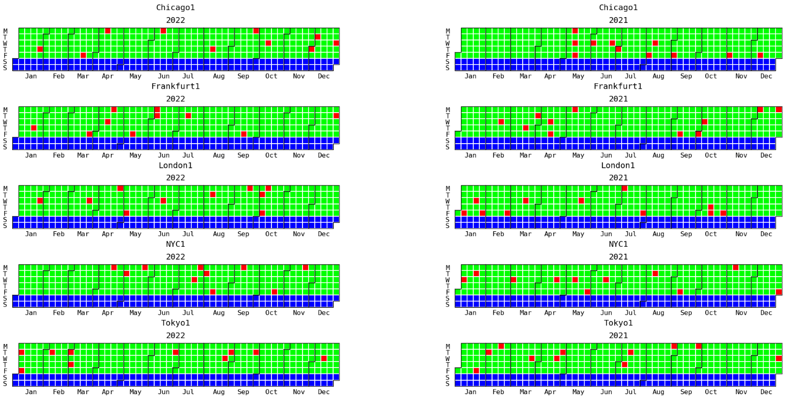
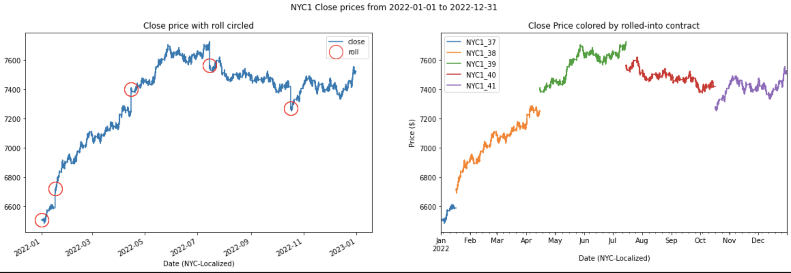
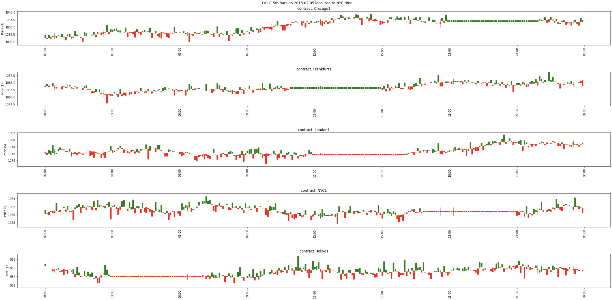
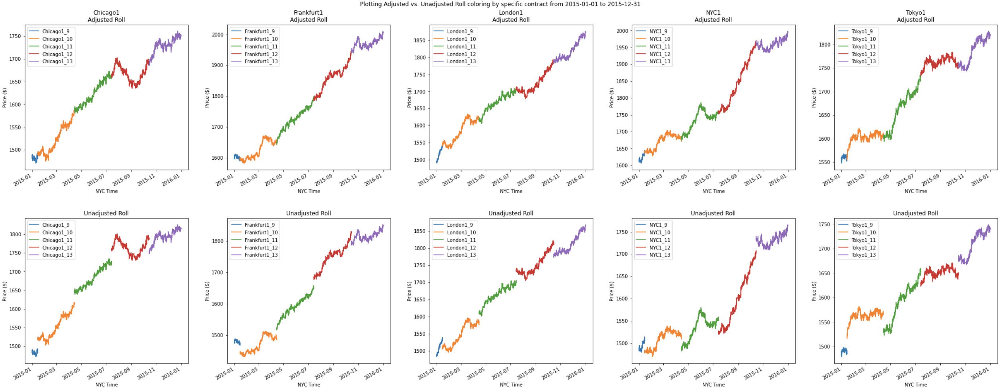
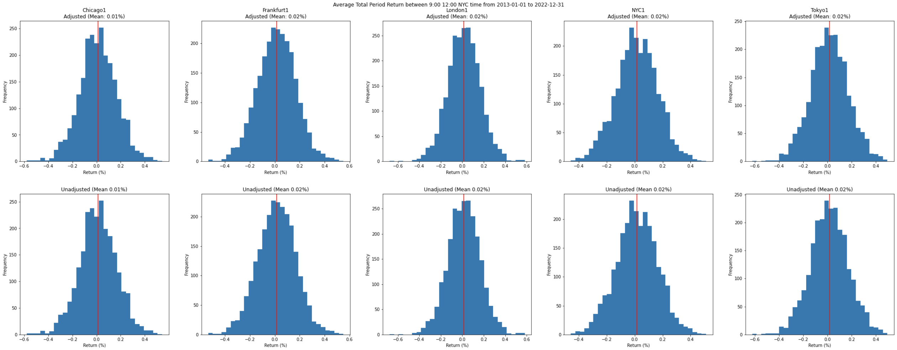
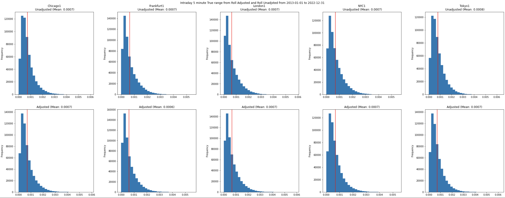
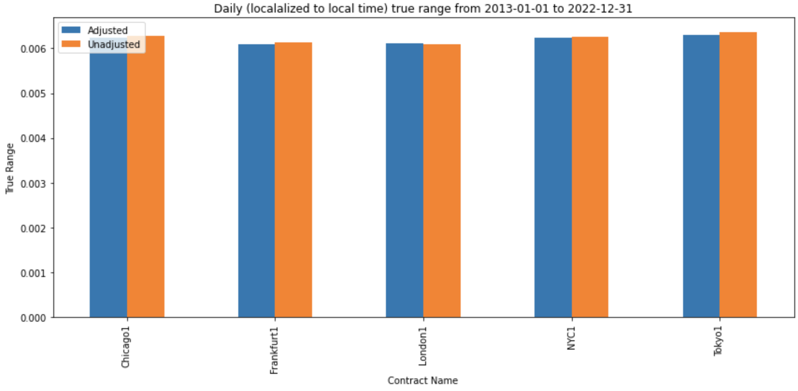

# Futures Synthetic Price Generation & Analysis
Diego Alvarez<br>
diego.alvarez@colorado.edu

## Dependencies & Codebase
For ease of use the notebook only uses ```pandas```, ```numpy```, and ```matplotlib``` with no other packages. A majority of the code, if not all, is written in fully vectorized pandas thus using minimal amount of for loops and relying on ```pd.groupby```, ```pd.agg```, ```pd.pivot```, ```pd.query``` and ```pd.melt```. The two main data generation files ```DateGenerator.py``` and ```PriceGenerator.py``` are fully OOP and upon instantiation of object they generate the data. Data is saved within ```.parquet``` to conserve space and is preserved in longer format, although sample data is saved as ```.csv```. 

# Repo layout
```bash
    Futures
      └───notebook
          │   analysis.ipynb
          │   MakeReadmePlots.ipynb
      └───src
          │   DateGenerator.py
          │   PriceGenerator.py
          │   MarketStats.py
          │   makeData.py
      └───data
          │   dates.parquet
          │   prices.parquet
          │   prices_samples.parquet
          │   prices_samples.csv
          │   prices1m_samples.parquet
          │   prices1m_samples.csv
```
```data``` directory is not present if repo is created from clone via git to preserve repo space. If repo is cloned, ```data``` directory is created and then filled. If repo is sent via ```.zip``` then ```data``` directory is present and filled with files.  

## src files:
* ```DateGenerator.py```: Creates data frame mask for specific contracts. When object is instantiated it defaults to required futures contract (see project requirements) but can take an arbitrary number of contracts. Upon initialization the object makes a dataframe with the correct open market days & hours. It also accounts for timezones and daylight savings as well. There are also functions within code to ensure that there are right number of days per year and hours per day (```_check_days_count()``` and ```_check_hours_count()``` respectively). File outputs ```dates.parquet```.

* ```PriceGenerator.py```: Creates synthetic price time series data built on top of output from ```DateGenerator.py``` using ```dates.parquet```. Synthetic time series includes price roll which is assumed to be the 15th of the last month of the quarter (if weekend or holiday then the following trading day). Upon instantiation of object the code creates the time series. There is also a helper function to ensure that OHLC relationship is preserved (```_check_ohlc```). File output ```prices.parquet```

* ```makeData.py```: Creates each object and uses method ```save_data()``` within ```DateGenerator.py``` and ```PriceGenerator.py```. Then runs ```make_sample()``` function which gets the last 1 year and 1 month sample  of the ```prices.parquet``` dataset and saves to file as parquet and csv respectively.


* ```MarketStats.py```: Object for creating chartpack to output the calculations. All methods are type ```void``` unless they are plotting. If verbose is set True then void functions will state how object attributes are saved to the object. This object is solely used in ```Analysis.ipynb```

## data files
* ```dates.parquet```: DataFrame mask for price series containing all contracts, all 5 min bars, with correct market open days and hours. Output from ```__init__()``` function of ```DateGenerator.py```.

* ```prices.parquet```: Synthetic price time series OHLC containing all contracts, accounting for roll. Output from ```__init__()``` function of ```PriceGenerator.py```

* ```prices_sample.parquet``` & ```prices_sample.csv```: Sample 1 year dataset. Later gets used in ```MakeReadmePlots.ipynb```. The ```.csv``` may be too big and thus a 1 month sample has been made as well.

* ```prices_1msample.parquet``` & ```prices_1msample.csv```: 1 month sample

notebook files
* ```analysis.ipynb```: Jupyter Notebook to run the calculations required.

* ```MakeReadmePlots.ipynb```: Makes plots for ReadMe file

# Data Generation 

### Project Requirements
1. 5 min OHLC of 10y worth of data <br>
    I. Data must preserve OHLC relationship <br>
2. 5 Futures contracts in their respective timezones <br>
    I. 1 Chicago <br>
    II. 1 NYC <br>
    III. 1 London <br>
    IV. 1 Frankfurt <br>
    V. 1 Tokyo <br>
3. Contracts get rolled on the 15th of the last month of the quarter or the following trading day if weekend (roll will be ~2% of contract value)
4. Work on a 250 day calendar and account for time zone changes
5. Market hours are 9pm to 5pm the following days
6. Once data is simulated calculate the following
    I. Find roll-adjusted close <br>
    II. Average Daily Volume <br>
    III. Average Daily True Range (roll adjusted and roll unadjusted) <br>
    IV. Average intraday returns based on NYC time zone (concurrently across markets) <br>

The last two are written in 2 different ways. The Average true range has a version that finds the range per each bar, and one that finds it for the OHLC of the day. The average intraday returns based on NYC time zone finds returns at the 5 min bar, and one that find the total return for the period. 

## Date Generation (```DateGenerator.py```)
### Functionality
Upon initialization of the DataGenerator object most of the parameters can be modified although they are defaulted. Arguments are defaulted as 

1. country_contract: type ```dictionary``` for modifying the number of contracts per each country
2. end_date: type ```datetime``` preset for the first day of the current year
3. year_lookback: type ```int``` preset for 10y which creates the lookback window

### Notation
Once the ```DateGenerator.py``` object has been fully initialized it is only prepped with dates and has the following format: contracts get generic names based on the country that is passed through following the form "Country Code" + num. Later in ```PriceGenerator.py``` and ```prices.parquet``` contracts get rolled and thus have new names. For example NYC1 and Chicago1 are akin to NYMEX Crude and CME Crude. By analog NYC1_1 and Chicago1_1 are akin to first NYMEX Crude contract and first CME Crude contract. For example:
| Start Date (NYC Localized)   | contract    |
|:-----------------------------|:------------|
| 2020-01-01 00:00:00          | NYC1_29     |
| 2020-01-01 01:00:00          | Chicago1_29 |
| 2020-01-15 00:00:00          | NYC1_30     |
| 2020-01-15 01:00:00          | Chicago1_30 |
| 2020-04-15 00:00:00          | NYC1_31     |
| 2020-04-15 01:00:00          | Chicago1_31 |

Therefore NYC1_29 is the 29th rolled contract and Chicago_31 is the 31st rolled contract. 

As per market hours the data takes this format 
| column name         |                            meaning    |
|:--------------------|:--------------------------------------|
| market_day          | If local market is open  for that day |
| market_hour         | If local market is open for that hour |

market_day can be open, closed, or holiday, while market_hour can only be open closed. 

### Holidays
Rather than accounting for specific holidays across market hours and the chance that market holidays may occur on weekends, the repo will use an alternative method. Since the specific project requires 250 trading days per year, the following method will be used: respective for the market's local time, there are (260 to 261) weekdays that are eligible candidates as trading days. The weekdays will be randomized and the first 250 will be considered trading days the remaining days (not including weekends) will be considered holidays. Unfortunately since there is no gaurantee that the holiday will land on a weekday in the following years, every year the holidays change in the local market. This is to fit in accordance with the 250 day rule.

Example of market trading days. Green: open, Blue: closed (weekend), red: closed (holiday) localized to local time. 



## Time Series generation (```PriceGenerator.py```)
### Price creation

Prices are created by sampling normal distribution to act as return. Rather than recursively summing values and trying to account for roll, return prices are simulated and then cumulative multiplied to back out a time series. Starting price values are sampled normally with mean $1,000 +- $30. Using cumulative returns and multiplying by a starting price makes the time series look more akin to financial time series and allows roll cost to be directly added in before cumulative returns. Although random seed is set, returns get zeroed out if market is closed therefore when calculations are done, returns can't be "backed-out" by using the same random seed. 


### Roll
Roll is done quarterly by the 15th of the last month of each quarter. If the 15th is closed (weekend or holiday) it moves to the following open day. To account for roll cost an extra +-2% is added to the curve. The 2% gets added to the synthetic return data and is assumed to be rolled on the first bar of the trade open. Backwardation and contango are assumed to appear in equal proportions implying that on roll day there is a 50-50 chance that cost may be +-2%. This is done by sampling binomial distribution replacing 0s with -1s multiplying by 2 and scaling for percentage. 

The following is an example of roll cost present in the data



### Buy and Sell Volume Generation
This is done by sampling from normal distribution with average ```1,000,000``` with +- ```300,000```. It gets applied to the dataframe and zeros out for when markets are closed.

### OHLC creation and preservation
Once time series have been backed out through cumulative returns its considered to be Open Price. To simulate low, high, and close price, sample from normal distribution to get synthetic dollar price moves. To ensure OHLC relationship is preserved take the absolute values. For example high prices are equal to backed out open prices + absolute value of random normals. The same for low but just "..." - absolute value of random normals. Close price is sampled from normal distribution with extremely small standard deviation and then added to close. There is a chance (extremely unlikely) that the dollar price change for close price is higher or lower than the high price and low price. Also the method ```_check_ohlc()``` ensures that the relationship is preserved and has yet to find any problems with the 10y worth of data generated.

Sample OHLC bars for a random day



# Replication
There are 3 ways to replicate the repo. If the repo was already received with the data ```prices.parquet``` added then just run the jupyter notebook ```analysis.ipynb```. 

To generate ```prices.parquet```
```
$ python ./src/makeData.py
```
This runs ```DateGenerator.py``` and ```PriceGenerator.py```. 

An alternative with no sample data is 
```
$ python ./src/DateGenerator.py
$ python ./src/PriceGenerator.py
```
Since random seed is set time series should be exactly the same in jupyter notebook.

# Calculations ```Analysis.ipynb``` & ```MarketStats.py```
## Roll Adjusted Close
Roll adjusted close is calculated by zeroing out the first bar on the day of the switching between contracts. Programmatically this is done by calculating bar return grouping by each contract and zeroing out the return associated with the first timestamp. Once zerod out returns are calculated cumulatively and are multiplied by original price to back out roll adjusted return. 

Plotting the difference between roll and adjusted roll


To ensure that contract roll is eliminated just sample from a specific year. 



The obvious gaps in the roll unadjusted close that are not present in the roll adjusted close show how it gets accounted for.

## Average Daily Volume
This is the histogram of the average daily volume per local time. Local market time was picked since using NYC market time may result in specific days (usually mondays and fridays) to have less market hours than the other days of the week. Take for example Tokyo if using NYC hours, Monday will have significantly less market hours then the other days of the week. This will lead to outliers on the plot. The following graph is a distribution with the mean average daily volume. 


## Average Intraday Return
This was described as what is the average return if a position is held from 9:00AM NYC time to 12:00PM NYC time. The code is written to take in a start hour and end hour of NYC-localized 24-hour clock and then calculate the returns. The code presets the hours as 9:00AM and 12:00PM although any two valid hours can be used. The code also calculates returns concurrently with other markets if they are open. This calculation (and later true range) uses the 5-minute bar. After programming it seems that 5-minute average return between two dates is somewhat meaningless. Therefore, a total close-close total range method has been written. 

### 5 Minute Bar
Here is a distribution of returns with mean.


### Average Total Range
The total range close-close method gets the first and last close of the bar for the respective hour then calculates returns. Here is a distribution of returns with mean



## Average True Range
### 5 Minute Bar
Same idea as above but instead use high - low / close. In this case the function was generated to find the true range for the 5 minute bars but later extended to the whole day (local time). Here is a distribution of the true range.



### Resampled daily
Same idea but price is resampled daily. Unfortunately it is not as easy as ```pd.DataFrame.resample()``` since the first bar open and last bar closed are required. The code accounts for this, gets the first bar open and last bar close and the high and low. Here is a distribution with averages as well. 


### Interpretation
An interesting result from these two functions is that when comparing the true range between roll-adjusted and roll-unadjusted its apparent which way the curve shapes with each contract. Although the price generation was written with 50%-50% likelihood of contango (negative roll) and backwardation (positive roll) the 5 minute bars shows the difference. On the other hand the daily resampled does not, this because the roll although ~2% of the price can still be muted out by the rest of the trading session's activity. 


